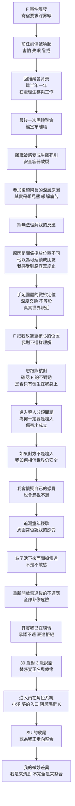

# 20260422 諮商對話流程

## 文件定位
這份文件不是逐字稿摘要，而是將 2026/04/22 諮商中的主要對話主軸，依照實際推進順序整理成一條較清楚的流程線。重點不是每一句說了什麼，而是這場談話如何從創傷事件出發，轉進關係定位、自我懷疑、防衛系統、童年經驗、內在角色，最後走到 SU 對當前狀態的理解。

## 對話流程圖

---

## 一、開場主訴：F 事件直接踩到前任創傷
談話一開始，是由 F 的寄宿要求切入。表面上是一次聚餐中的不舒服互動，但真正被喚起的是更早的創傷記憶，也就是「我已經說不要了，對方卻還是持續推進」的經驗。這讓事件不只是討厭或冒犯，而是迅速升級成驚嚇、失眠、身體進入警戒的反應。

這裡的核心不是單純評估 F 有沒有失禮，而是這個事件讓我重新碰到一個很深的恐懼：我是不是其實還是會再次遇到那種侵犯界線的人？而且我是不是未必保護得了自己？

---

## 二、為什麼會去那場聚會：不是普通聚餐，而是帶著失落與牽掛前往
對話接著往前回推，談到「我為什麼會參加那場聚會」。這一段把事件放回更長的時間軸裡：

- 這半年到一年，我主要在處理生存與工作壓力，也因此逐漸淡出手足團體。
- 後來工作相對穩住後，我轉而沉浸在自己的精神世界，也開始整理過去感情經驗。
- 即使如此，最後一次團體聚會我還是決定去，因為那個場域對我並不是可有可無的。

真正重要的轉折是：在最後一次團體聚會裡，熊宣布自己要離職。這對我來說不只是工作異動消息，而是某種「長期承諾突然終止」的斷裂感。原本以為還有時間、還可以以後再見、還可以之後慢慢珍惜，但現實突然變成「最後一次已經到了」。這種衝擊在我心裡接近生離死別。

所以，後來參加那場四人聚會，表面理由是更新彼此近況，但更深一層的動機其實是：我想見熊。更準確地說，是熊離職帶來的失落沒有真正結束，而我會去那場聚會，其中一個沒明說出口的原因，是私下還能見到熊、還有機會與他相處，會緩解我的痛苦。

---

## 三、熊為什麼無法理解我的反應：我們擺放關係的位置不同
這場談話裡，熊的「無法理解」是一條很關鍵的線。對熊來說，他離開的是一份工作，但關係未必終止，因為他認為彼此仍然可以私下聯絡、甚至成為朋友；因此他不容易理解，為什麼這件事會被我感受成近似「失去」。

但對我來說，原本的關係有其特定的容器與前提。即使那個團體不是典型治療團體，它仍然不是完全私人、也不是普通朋友關係。正因如此，一旦熊離職，那個安全容器就破了，原本關係的成立條件也跟著改變。於是我們在談的是同一件事，卻站在不同位置理解它。

這也連到我後來沒有說出口、但其實很重要的一點：我並不是單純為了更新近況而參加聚會，而是因為想見熊。這讓那場聚會在我心中的重量，跟其他人可能理解的完全不同。

---

## 四、手足團體的微妙定位：深度交換不等於真實世界的親近
SU 接著幫談話拉出另一條軸線，也就是手足團體成員在我生命中的位置。這裡浮現一個很重要的辨識：

- 在團體裡，大家會交換非常深的生命經驗。
- 但在真實世界裡，這不自動等於彼此就是親密朋友。
- 對我來說，手足團體成員未必在內圈，甚至可能只是比較外圍的位置。
- 對 F 來說，這層關係顯然被放得更靠近、更核心。

於是 F 提出寄宿要求，不只是踩界線而已，也暴露了彼此對關係定義完全不同。這使得我不只感到被冒犯，也感到自己被當作可運用的資源來盤算。

---

## 五、我為什麼想跟熊核對：想確認 F 的不對勁，是否只有發生在我身上
談到後半，焦點轉成「我到底想找熊核對什麼」。這不是單純要告狀，也不是要熊主持公道，而比較像是：如果以朋友身分去問，我想知道 F 的這種不對勁，是只出現在我和他的互動裡，還是別人也會感受到？

這個核對的需求，背後其實是在處理我對現實判斷的不安。我不是完全相信自己的感受，所以會希望透過熊的觀察，幫忙確認這份怪異感到底是不是只有我「想太多」。

---

## 六、為什麼我需要把 F 先放進「壞人」：因為那樣傷害才比較說得通
接下來談話碰到一個很核心的心理結構：我會想把 F 分類成壞人。這不是單純道德評價，而是一種讓世界恢復可理解的方法。

如果對方是壞人，那麼他傷害我就合理；世界雖然危險，但至少危險有標記。可是一旦對方不是徹底的壞人，我就會混亂：為什麼一個不完全是壞人的人，仍然可以造成傷害？那我到底要怎麼判斷？我又該不該繼續和這樣的人相處？

因此，真正的問題不是「F 是不是壞人」，而是「我能不能承認傷害成立，而不必先把對方判死刑」。SU 在這裡指出：感到受傷本身就是事實，並不需要先靠壞人分類來取得合法性。

---

## 七、我為什麼會懷疑自己的感覺：童年經驗讓我習慣忽視不適
談話再往下挖，就碰到更深的來源。我會先懷疑自己的不適感，甚至假裝忽略它，並不是因為我沒有感覺，而是因為我從小學到：我的感覺不一定會被周圍承認。

我對自己的理解是，我其實是一個敏感的孩子，但周圍的人，尤其主要照顧者，未必感覺得到我所感覺到的東西。當一個孩子 repeatedly 感受到某些不對勁，卻一直被環境回應成「沒有這回事」「你想太多了」，她就會逐漸開始懷疑：是不是我的感覺是假的？

所以我後來不是沒有雷達，而是學會把雷達關掉，或者至少把它調得很低，先去校準別人的世界，而不是相信自己的世界。

---

## 八、我其實已經在練習了：從忽略不適，到開始承認不適
SU 在這裡做了一個重要的提醒：現在的我其實不是毫無進展，而是已經開始練習覺察不適、接受不適，並且對不適做出反應。

也就是說，這場事件雖然把我嚇壞了，但它同時也證明了一件事：我沒有像過去那樣一路忽略到底。我有感覺到，我有拒絕，我有封鎖，我有試著辨識這件事對我的傷害。只是因為這條能力還在發展中，所以我會覺得非常笨拙、非常累，甚至冒出「怎麼現在才開始」的挫敗感。

---

## 九、關閉雷達的原因：那是為了活下來，不是因為我不夠敏感
這一段是後半非常重要的重構。SU 幫我把「忽略感覺」重新理解成一種生存策略，而不是缺陷。

在童年與家庭危機裡，若我長期處在高壓、混亂、無法逃離的環境中，那麼太完整地接收所有危險訊號，反而會讓我無法活下去。於是我只好調低感覺、蓋住不適、讓自己能留在現場。這代表我不是沒有雷達，而是雷達太早就被迫進入生存模式。

這個理解很關鍵，因為它把「我為什麼總是懷疑自己」從一種失敗，改寫成一種曾經必要的適應。

---

## 十、重新開啟雷達後，為什麼反而更痛苦：因為一切都像危險
但雷達一旦重新打開，也不會立刻變成穩定好用的工具。對我來說，重新開啟感知後的困難是：我會一下子看見太多危險，太多不安全，太多令人緊張的訊號。

所以這場談話不是在鼓勵我完全打開或完全關閉，而是在摸索一件更細緻的事：我怎麼知道要開到什麼程度、關到什麼程度、留下哪些訊息、過濾哪些訊息。這是一種重新學習使用感受系統的過程，而不是簡單叫自己不要怕。

---

## 十一、30 歲對 3 歲說話：療癒開始於替感覺正名，但我對此也有尷尬感
在後段，SU 引導我用三十歲的自己去對三歲的自己說話。這段的核心不是單純的溫柔想像，而是重新建立一種內在見證：

- 你的感覺都是真的。
- 別人感覺不到，不代表它不存在。
- 即使害怕，也可以一起看。
- 三十歲的我，已經比三歲時更能語言化、更有資源，也更有能力保護自己。

這是一個很直接的療癒動作，因為它在修補童年時期那個「感覺存在，卻沒有人替我命名」的斷裂。

不過對我來說，這裡也帶有某種尷尬感。尷尬不一定代表抗拒，而比較像是：我知道這個動作有意義，但當它真的發生時，我還沒完全習慣用這麼直接、具象、照護性的方式對待自己。

---

## 十二、小淺、夢、K：從單一事件進入整個內在系統
對話到尾聲時，焦點逐漸離開單一事件，轉向我的內在角色系統。

### 1. 小淺
小淺被放在「潛意識／感覺雷達／夢的訊息來源」的位置。她本來一直在講話，只是我過去常嫌她吵、忽略她。這次談話把她重新理解成一個努力示警、努力傳話、甚至努力用夢幫我排感受的角色。

### 2. 夢的畫面
我描述了潛意識入口的畫面：青天、草地、一扇突兀的門，門後有很多眼睛。這個畫面顯示，潛意識對我來說不是抽象概念，而是一個有空間感、入口感、甚至帶有群體性的內在場域。它既吸引人，也會讓人被它的量嚇到。

### 3. 阿尼瑪小淺
朋友曾用阿尼瑪的語言理解小淺，但我更傾向保留她作為「小淺」本人的位置。這反映出我並不是只是借用理論框架，而是真的把她當作一個持續互動中的內在角色來經驗。

### 4. 阿尼瑪斯 K
K 是在夢中出現的男性角色，也被朋友理解為阿尼瑪斯。他帶著危險、暴力、抗衡、拯救的氣質，並且與我家庭危機中的求生力量有關。K 不是單純的浪漫象徵，而比較像是從危險環境中長出來、能與暴力對抗的一股力量。

這一整段讓談話從「F 到底怎麼回事」進一步走到「我的內在世界此刻如何運作」。事件變成入口，而不是全部。

---

## 十三、收尾時的差異：SU 認為我在走向整合，但我原本是來清創
談話最後，SU 對我此刻狀態的理解是：我現在不主要是在處理一個緊急危機，而是正走在一個自我探索與整合的歷程裡。我已經不只是被事件打到，也開始看見自己的能力、感受與各內在部分之間的合作可能。

但這裡和我的原始目的之間，有一個微妙的落差。SU 的收尾傾向將此刻命名為「整合」，而我原本來談，更像是要做「清創」: 我是來處理被勾起的傷口，想搞清楚發生了什麼、哪裡受傷、哪些界線被踩到。整合也許是談話最後確實浮現的方向，但它不完全等於我一開始前來的任務。

因此，若要總結這場諮商的整體走向，可以說：

- 我原本帶著創傷事件進來。
- 對話中逐步碰到熊、F、手足團體與關係定位的混亂。
- 再往下挖到我為何需要壞人分類、為何不信自己的不適。
- 之後進入童年如何關閉雷達，以及如今如何重新學會使用它。
- 最後則開展到小淺、夢、K 與多重內在部分，並被 SU 收束為一條朝整合前進的路。

而對我自己來說，這整場談話最貼近的描述或許是：我原本是來清創，但途中被帶進了更大的內在地圖。
